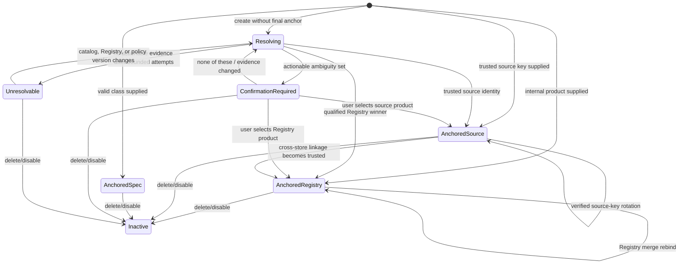

# Watch Confirmation Design Review

Status: design proposal, no implementation  
Date: 2026-07-29  
Scope: watch creation, product anchoring, legacy migration/backfill, candidate generation, automatic resolution, manual confirmation, and monitoring state

## Executive decision

The current system is safe in one important sense: it refuses to monitor an unanchored watch and does not silently guess. The problem is that it treats the Registry's `review` result as if it always meant “the user must choose a product.”

That equivalence is false.

`review` currently includes at least three materially different situations:

1. the listing is too thin for the Registry's ingestion contract;
2. one or more products are plausible but the Registry will not automatically attach;
3. the source identity is already sufficient for the requested watch, but is not accepted as a Registry identity.

Only the second situation can justify confirmation. The first should be system-owned unresolved work. The third should be anchored from its trusted source identity without involving the user.

The proposed philosophy is:

> Confirmation is an escalation for a concrete identity choice, not a fallback for missing evidence, vocabulary gaps, conservative Registry thresholds, or candidate-generation failure.

This preserves the product-anchored architecture while separating three decisions that currently share one threshold:

- may this observation teach the global Registry?
- is there enough evidence to anchor this user's watch?
- is this later price observation safe enough to alert on?

Those decisions have different blast radii and should not be forced through the same outcome.

## 1. Current pipeline

### Creation

The frontend opens the shared watch dialog from search summary, marketplace cards, Browse cards, and brochure product sheets. It posts:

- the user's intent (`kind`, query, target, matching controls);
- a retailer product ID when available;
- a listing snapshot when the caller supplied one, or a fallback assembled by the dialog;
- display metadata such as label, image, link, brand, and size.

`buildWatch` turns that request into one of three effective forms:

- `registry_product_id`: already an internal Registry product;
- `spec`: a declared flexible class;
- unanchored strict watch: must pass through `anchorWatch`.

`POST /watches` runs `anchorWatch` synchronously and saves the watch even if it could not be anchored.

### Anchoring

`anchorWatch`:

1. accepts an existing Registry anchor or spec without further resolution;
2. converts the listing into an Identity Candidate;
3. passes the candidate to the shared Registry resolver;
4. attaches an existing product on `attach`;
5. mints a new Registry product on `create`;
6. converts every other result to `needs-confirmation`.

The Registry candidate contract requires at least two of `family`, `cut`, `processing`, and `variety` before automatic Registry evaluation. Brand, package, count, and size are corroborating evidence but cannot establish a Registry identity.

### Legacy migration and backfill

The SQL migration:

- copies legacy `kind=registry` product IDs into `registry_product_id`;
- derives `scope`;
- stamps every other unanchored row `pending-migration`.

The one-time backfill then:

- converts relaxed legacy watches into specs when possible;
- sends strict legacy watches through the same `anchorWatch`;
- writes an anchor, `needs-confirmation`, or `unresolvable`;
- deliberately performs no live retailer search.

Retrying the backfill re-enters the same resolution path.

### Candidate generation and confirmation

For a watch in `needs-confirmation`, the UI calls `/watches/candidates`.

That endpoint reconstructs an Identity Candidate from the watch label while explicitly passing no brand and no size. It does not:

- persist or reuse the original listing snapshot;
- search the live catalog;
- use the retailer product ID;
- compare the watch image;
- use price history or existing retailer matches.

It asks the Registry resolver for diagnostic candidates, takes up to eight product IDs, and renders them. The returned set is not a curated ambiguity set: it is not explicitly filtered to non-vetoed candidates, not sorted by confidence, and has no score, margin, image, or explanation.

The UI offers only candidate buttons. It has no “none of these” answer.

### Monitoring

Only a valid Registry product anchor or spec is monitorable. Daily checks never create `needs-confirmation`; they skip unanchored watches and retain their existing state. An anchored watch that later fails resolution remains anchored and receives diagnostic telemetry.

This part of the philosophy is sound: monitoring must not degrade into lexical matching.

## 2. Why the reported examples happen

### Snickers Ice Cream Bar 6 × 40 g

The production watch is a legacy Panda product watch. Its stored retailer ID is no longer the current Panda ID, but the live catalog's top result has:

- the exact same product name;
- the same brand;
- the same 6 × 40 g quantity;
- the same image URL;
- a new retailer ID.

The current backfill never performs that lookup. It ignores the old retailer ID, image, and link as identity evidence and resolves only the stored textual/structured candidate against the Registry.

The live listing extracts approximately:

- brand: Snickers;
- family: chocolate;
- size: 40 g;
- count: 6.

Only `family` belongs to the Registry's identity-establishing set. Because brand, size, and count are deliberately corroborating-only, the candidate fails the “two semantic dimensions” gate. The Registry returns an insufficient `review`, and `anchorWatch` translates that into `needs-confirmation`.

The catalog knows the item. The Registry ingestion contract cannot establish it. The watch layer currently treats those as the same fact.

### Amazon products

An Amazon watch is created as `kind=product`, scoped to Amazon, with an ASIN. The code describes that retailer ID as a cache, not an anchor. `anchorWatch` therefore ignores the fact that the user selected an exact Amazon listing and still requires a `pr_` Registry identity.

This is especially damaging outside the grocery taxonomy. Shoes, diapers, and other products often do not yield two of the Registry's grocery-oriented semantic dimensions. The result is `review` even though `(amazon, ASIN)` already answers the store-scoped watch's identity question.

The confirmation endpoint then discards the ASIN and original structured evidence, so it commonly returns zero candidates.

### Why all current confirmation pickers are empty

There are two causes:

1. `anchorWatch` does not request resolver diagnostics, so its immediate `candidates` response is empty even for a resolver review that had blocked products.
2. the later candidate endpoint rebuilds a weaker candidate from label-only data. For insufficient Identity Candidates, the Registry correctly returns no product candidates at all.

Production confirms the outcome: all nine active `needs-confirmation` watches currently return zero candidates.

## 3. Every entry into `needs-confirmation`

There is one state writer, `anchorWatch`, and two normal callers plus one retry path.

| Entry path | Trigger | Current result | Decision |
|---|---|---|---|
| Foreground creation of a strict product or grocery watch | Resolver returns `review` | `needs-confirmation` | Too broad; split by reason |
| Legacy strict-watch backfill | Same resolver result from stored evidence | `needs-confirmation` | Too broad; must rehydrate trusted/live evidence first |
| Explicit legacy retry | Same as backfill | `needs-confirmation` again | Acceptable only after policy/version or evidence changed |
| Relaxed creation whose derived spec is invalid | `specFromBody` returns null, silently making the watch strict | May reach `needs-confirmation` | Unjustified; reject or retain a resolution-pending spec intent |

Within `anchorWatch`, “resolver returned review” covers:

| Resolver condition | Does a human add value? | Proposed handling |
|---|---|---|
| Invalid or insufficient Identity Candidate | No candidate choice exists | `resolving` then `unresolvable`, not confirmation |
| Best score is between Registry review and attach thresholds | Sometimes | Confirm only if an actionable ambiguity set exists |
| High score demoted because one side lacks size | Sometimes | Auto-anchor if independent source evidence closes the gap; otherwise ask only when concrete pack variants are shown |
| Semantic-only high score requires review | Sometimes | Use source provenance, uniqueness, and score margin; do not ask by default |
| `create` cannot produce a product row | No; this is an invariant/data failure | `unresolvable` with an operator reason |

The migration itself never writes `needs-confirmation`; it writes `pending-migration`. Daily monitoring never writes it either.

## 4. Review of the existing philosophy

### What should remain

- Unanchored watches must never monitor through a lexical fallback.
- Brand, size, family, cut, processing, and variant conflicts remain hard vetoes when the evidence is present.
- Missing evidence must not be treated as proof of equality.
- Registry merges may rebind an existing Registry anchor.
- Check telemetry must report failures instead of presenting a dead watch as “still watching.”
- Flexible watches remain explicit specs, not fuzzy strict watches.

### What should change

#### Registry safety is being applied at the wrong boundary

The Registry threshold protects a shared, long-lived identity ledger and may teach future matching. A watch anchor is profile-scoped and confirmation itself already does not teach the Registry. Therefore a watch can accept strong contextual evidence without authorizing Registry learning.

The watch resolver should consume the Registry's decision as one signal, not copy its `review` label directly into a user workflow.

#### Source identity is discarded

The selected listing is high-value evidence. A trusted provider's namespaced external key can safely anchor a store-scoped watch even when it is not sufficient to claim cross-store equivalence.

For a market-scoped watch, the same source key should provide immediate monitoring at its source while Registry linkage proceeds independently. It must not be treated as proof that a different retailer listing is the same product.

#### Candidate count is not confidence

“Exactly one candidate” is not sufficient by itself. Blocking may have missed alternatives. Automatic anchoring requires:

- an absolute confidence threshold;
- no hard conflicts;
- enough independent evidence;
- a meaningful margin over the runner-up;
- a candidate search with adequate coverage.

Conversely, several raw blocked products do not necessarily justify asking. Vetoed or obviously inferior candidates must not be shown.

#### No-candidate confirmation is a category error

If the system cannot offer a concrete choice, the user cannot resolve the system's missing evidence. The state must be system-owned and non-actionable.

## 5. Proposed confirmation philosophy

### Core rule

Ask only when all of these are true:

1. the watch does not already have a valid anchor;
2. source identity is not already sufficient for the requested scope;
3. automatic resolution produced one or more concrete, plausible choices;
4. the choices are materially different products, not duplicate sightings;
5. the UI can show enough evidence for a person to decide;
6. the answer will change the anchor.

### Evidence hierarchy

Evaluate evidence in this order:

1. **Declared internal identity**  
   A valid `registry_product_id` is final. Never ask.

2. **Declared class identity**  
   A valid spec is final. Never ask.

3. **Trusted source identity**  
   A provider plus a source-native product key anchors that provider's exact product. Amazon ASINs qualify for Amazon-scoped watches. Other providers may qualify only after their key stability and reuse behavior are documented. Store scope can monitor immediately; cross-store linkage remains separate.

4. **Existing source-to-Registry mapping**  
   If the selected listing or offer already carries a trusted Registry product ID, use it directly. Do not re-resolve text.

5. **High-confidence equivalence**  
   Auto-anchor when a single winner has no conflicts, exceeds the watch-specific threshold, has sufficient independent evidence, and leads the runner-up by a calibrated margin. Exact image equality is strong corroboration but never sufficient alone.

6. **Actionable ambiguity**  
   Ask when two or more qualified candidates remain. A single medium-confidence candidate may be shown as a yes/no question only when the original listing snapshot and candidate evidence make the comparison meaningful.

7. **Insufficient evidence**  
   Keep resolution system-owned. Retry when the catalog, Registry, or resolver version changes; eventually label it unresolvable. Do not ask an empty question.

### Challenge to the suggested rules

- **“Already anchored → never ask”**: accepted. If later checks fail, retain the anchor and show monitoring diagnostics or an optional repair flow. Do not turn an established identity back into a blocking confirmation.
- **“Trusted external identity → never ask”**: accepted for the source scope. It does not, by itself, prove cross-retailer equivalence. The watch can monitor the trusted source immediately while global linkage remains pending.
- **“Exactly one high-confidence candidate → auto-anchor”**: accepted only with an absolute threshold, veto checks, evidence coverage, and a runner-up margin.
- **“Several plausible candidates → ask”**: accepted after deduplication and qualification. Raw blocked candidates do not count.
- **“Insufficient evidence → unresolvable”**: accepted as a user-facing outcome, but internally it should first be retryable `resolving`. New evidence should heal it automatically without another migration.

### Confirmation interaction contract

A confirmation request must contain:

- two or more qualified products, or one genuinely reviewable candidate;
- image, canonical name, brand, pack/size, and source availability;
- the evidence that differs;
- “None of these” and “Decide later” actions;
- a stable candidate snapshot/version so the choice cannot mutate under the user.

If this contract cannot be met, no confirmation CTA is shown.

## 6. Proposed watch state machine

Identity state and monitoring health must be separate. `last_resolution` currently carries both migration/identity state and daily check telemetry, which makes the model harder to reason about.

### Identity states

- `resolving`: no anchor yet; system-owned, retryable;
- `anchored_registry`: strict internal product anchor;
- `anchored_source`: trusted provider product anchor, optionally linked to a Registry product;
- `anchored_spec`: declared flexible class;
- `confirmation_required`: actionable candidate set exists;
- `unresolvable`: bounded resolution attempts found no actionable evidence;
- `inactive`: deleted or disabled.

### Monitoring health

Only anchored states have monitoring health:

- `unchecked`;
- `ok`;
- `not_found`;
- `no_price`;
- `provider_error`;
- `anchor_unavailable`.

Deal/close/above-target remains price status, not identity status.

An anchored watch never transitions to `confirmation_required`. A later identity problem changes monitoring health and may offer an optional repair action, but it does not erase the user's established anchor.

## 7. Preventing incorrect automatic links

The proposal does not lower the global Registry's attach threshold. It adds a watch-specific decision layer with bounded consequences and explicit provenance.

### Hard safety gates

Automatic cross-product linkage is forbidden when any trusted evidence conflicts:

- provider/source key maps to a different established product;
- brand conflict;
- incompatible measured size or pack count;
- family, cut, processing, or variant conflict;
- source image is known to be shared across variants;
- candidate is a Registry tombstone without a valid survivor.

### Confidence must be multi-signal

Independent signals may include:

- existing internal product ID;
- established provider-key mapping;
- exact normalized title or bilingual title equivalence;
- brand;
- pack and measured size;
- image fingerprint;
- repeated sightings across stores or weeks;
- price-history identity;
- Registry score and match band.

No single weak signal, including image equality or one lexical token, may establish cross-store equivalence.

### Margin and coverage

A winner must beat both:

- an absolute auto-anchor threshold;
- a minimum margin over the second qualified candidate.

If candidate retrieval is degraded or incomplete, automatic cross-store anchoring is disabled. A single result from a failed search is not “unique.”

### Provenance and reversibility

Persist:

- anchor type;
- evidence snapshot;
- resolver/policy version;
- confidence and runner-up margin;
- source key and source snapshot;
- whether the anchor may teach the Registry.

Automatic watch anchoring must not update Registry token profiles. A wrong profile-scoped anchor can then be corrected without contaminating shared identity. Registry learning remains behind the existing Registry policy or explicit review.

### Alert-time verification

Keep the independent pre-notification verification gate. For a source anchor:

- prefer an exact provider key;
- validate identity continuity against the stored source fingerprint;
- treat a missing or conflicting listing as `not_found`/`anchor_unavailable`;
- never fall back to a merely similar lexical result.

For cross-store observations, require a trusted Registry mapping or the existing strict verifier.

## 8. Expected impact on current production watches

Read-only production snapshot on 2026-07-29:

| State | Active watches |
|---|---:|
| Anchored/monitorable | 6 |
| Needs confirmation | 9 |
| Unresolvable | 4 |
| Total | 19 |

All nine confirmation requests currently return zero candidates.

Expected disposition under the proposed policy:

| Current group | Count | Proposed result |
|---|---:|---|
| Amazon exact-product watches with ASINs | 6 | Source-anchor immediately; no confirmation |
| Panda Snickers 6 × 40 g | 1 | Auto-anchor/rebind from exact live name, brand, pack, and unchanged image |
| Sunbulah breaded frozen shrimp 400 g | 1 | Auto-anchor from exact, repeated live catalog evidence; distinguish the spicy sibling |
| Generic “coffee latte capsules” | 1 | Keep confirmation; multiple brands/products and pack forms are genuinely plausible |

Point estimate: **8 of 9 confirmation requests disappear (88.9%)**.

Conservative lower bound: **7 of 9 (77.8%)**, counting only the six Amazon watches and the exact Panda product before recalibrating cross-store candidate scoring.

If the point estimate holds, monitorable watches rise from 6 to 14 and only one user-actionable confirmation remains. The four existing `unresolvable` rows should be reconsidered by the new resolver, but they are not included in the confirmation-reduction estimate.

## 9. Implementation roadmap

### Phase 0 — freeze evidence and define acceptance criteria

- Preserve the 19-row production snapshot as redacted regression fixtures.
- Capture live candidate snapshots for Snickers, Sunbulah shrimp, and coffee latte capsules.
- Define false-link, confirmation-rate, zero-candidate, resolution-latency, and monitorable-watch metrics.
- Establish provider trust classifications, beginning with Amazon ASIN.

Exit criteria:

- every proposed auto-anchor has reviewable evidence;
- the coffee-latte case remains ambiguous;
- no current confirmation can render with zero candidates.

### Phase 1 — separate identity state from monitoring telemetry

- Add explicit anchor state/type/provenance fields.
- Stop encoding identity workflow in `last_resolution`.
- Keep existing columns readable during rollout for backward compatibility.
- Make invalid derived specs a validation/resolution error rather than silently converting them into strict watches.

### Phase 2 — preserve creation intent and trusted identity

- Persist the original listing snapshot and source provenance needed for resolution.
- Carry an existing Registry product ID from search/offer results directly into watch creation.
- Add a provider-key identity ledger or equivalent source-anchor representation.
- Allow trusted source anchors to monitor immediately within their source scope.

### Phase 3 — build a watch resolution policy above the Registry

- Replace the direct `Registry review → needs-confirmation` mapping with typed outcomes.
- Rehydrate trusted product watches from their provider before label-only resolution.
- Generate candidates from Registry products, live/cached catalog identities, price-history identities, and known source mappings.
- Deduplicate retailer sightings into product choices.
- Rank and filter candidates with hard vetoes, absolute confidence, coverage, and runner-up margin.
- Persist the candidate snapshot and decision explanation.

### Phase 4 — redesign confirmation

- Show confirmation only for an actionable candidate set.
- Include image, brand, size/pack, source presence, and distinguishing evidence.
- Add “None of these” and “Decide later.”
- Treat the user's answer as watch-anchor evidence first; decide separately whether it should teach the Registry.
- Remove confirmation wording from non-actionable unresolved states.

### Phase 5 — shadow evaluation and calibrated rollout

- Run the new resolver in shadow mode against existing and newly created watches.
- Compare old/new outcomes without changing anchors.
- Manually audit every proposed auto-anchor in the initial 19-watch set.
- Calibrate thresholds on false-link rate and ambiguity precision, not confirmation reduction alone.
- Enable trusted source anchors first, then high-confidence cross-store auto-anchoring.

### Phase 6 — idempotent backfill

- Reprocess `needs-confirmation` and `unresolvable` rows under a versioned policy.
- Apply source anchors and qualified Registry anchors in small durable batches.
- Retain existing valid anchors unchanged.
- Report per-watch before/after state, evidence, and reason.
- Never mint or teach shared Registry identity merely to clear a confirmation count.

### Phase 7 — operational safeguards

- Dashboard confirmation requests by reason and candidate count.
- Alert on any `confirmation_required` row with zero actionable candidates.
- Track auto-anchor reversals and false-alert reports by evidence class.
- Automatically retry `resolving`/`unresolvable` watches when source mappings, Registry contents, or resolution policy versions change.

## Acceptance principles

The redesign is successful when:

1. a trusted exact-product watch starts monitoring immediately;
2. a known internal product never asks for confirmation;
3. a unique, well-separated candidate auto-anchors without teaching the Registry;
4. a genuinely ambiguous watch shows concrete, distinguishable choices;
5. a no-evidence watch asks nothing of the user;
6. no unanchored watch can alert;
7. no anchored watch loses its identity because later retrieval becomes ambiguous;
8. every automatic decision is explainable and reversible.

